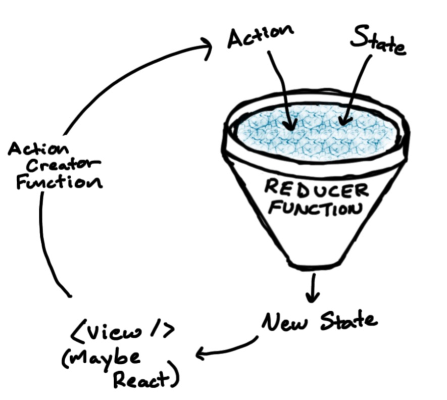
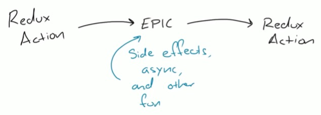
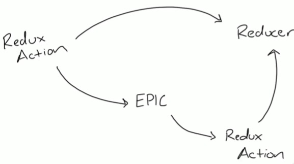
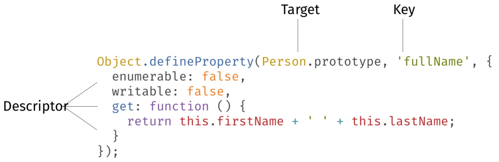
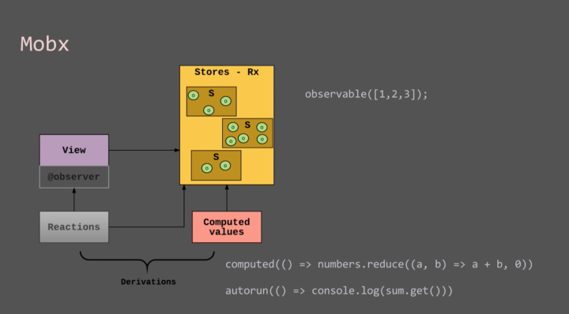
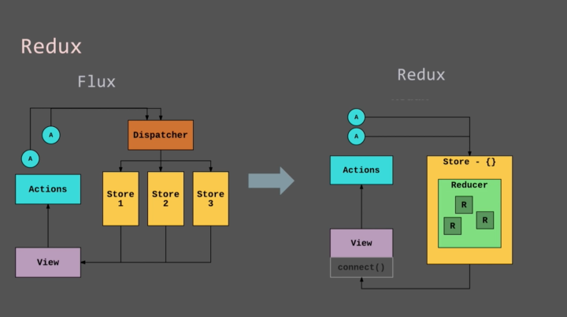

# State Management

## Table of Contents
- [State Management](#state-management)
  - [Table of Contents](#table-of-contents)
  - [Part 1: State Management in Pure React, v2](#part-1-state-management-in-pure-react-v2)
    - [**01. Introduction**](#01-introduction)
      - [Types of State](#types-of-state)
    - [**02. Class-Based State**](#02-class-based-state)
      - [setState & Class](#setstate--class)
      - [setState & Asynchronicity](#setstate--asynchronicity)
      - [setState & Function](#setstate--function)
      - [setState & Callback](#setstate--callback)
      - [setState & Helper Function](#setstate--helper-function)
      - [document.title Exercise](#documenttitle-exercise)
      - [document.title Solution](#documenttitle-solution)
      - [setState Patterns](#setstate-patterns)
        - [When we’re working with props, we have PropTypes. That’s not the case with state.](#when-were-working-with-props-we-have-proptypes-thats-not-the-case-with-state)
        - [Don’t use this.state for derivations of props.](#dont-use-thisstate-for-derivations-of-props)
        - [Don’t do this. Instead, derive computed properties directly from the props themselves.](#dont-do-this-instead-derive-computed-properties-directly-from-the-props-themselves)
        - [You don’t need to shove everything into your render method.](#you-dont-need-to-shove-everything-into-your-render-method)
        - [You can break things out into helper methods.](#you-can-break-things-out-into-helper-methods)
        - [Don’t use state for things you’re not going to render.](#dont-use-state-for-things-youre-not-going-to-render)
        - [Use sensible defaults.](#use-sensible-defaults)
    - [**03. Hooks State**](#03-hooks-state)
      - [Refactoring & Hooks](#refactoring--hooks)
      - [useEffect & Dependencies](#useeffect--dependencies)
      - [useEffect Exercise](#useeffect-exercise)
      - [useEffect Solution](#useeffect-solution)
      - [Refactoring & Custom Hook](#refactoring--custom-hook)
      - [Persisting State & useRef](#persisting-state--useref)
        - [How do lifecycle methods and hooks differ?](#how-do-lifecycle-methods-and-hooks-differ)
      - [useEffect & Cleanup](#useeffect--cleanup)
    - [**04. Reducers**](#04-reducers)
      - [useReducer Introduction](#usereducer-introduction)
      - [Reducer Action & State](#reducer-action--state)
      - [Reducer Action Keys & dispatch](#reducer-action-keys--dispatch)
      - [Action & State Modification Exercise](#action--state-modification-exercise)
      - [Action & State Modification Solution](#action--state-modification-solution)
      - [React.memo & useCallback](#reactmemo--usecallback)
    - [**05. Context**](#05-context)
      - [Prop Drilling & Context API](#prop-drilling--context-api)
      - [Creating a Context Provider](#creating-a-context-provider)
      - [Context & useContext Hook](#context--usecontext-hook)
      - [Context Practice](#context-practice)
    - [**06. Data Fetching**](#06-data-fetching)
      - [Data Fetching & useEffect Hook](#data-fetching--useeffect-hook)
      - [Response, Loading, & Error](#response-loading--error)
      - [Refactoring to a Custom Hook](#refactoring-to-a-custom-hook)
      - [Refactoring to a Custom Reducer](#refactoring-to-a-custom-reducer)
    - [**07. Thunks**](#07-thunks)
      - [What is a Thunk](#what-is-a-thunk)
      - [useThunkReducer Hook](#usethunkreducer-hook)
      - [Dispatching, Reducers & Hooks](#dispatching-reducers--hooks)
      - [Routing & Thunks](#routing--thunks)
      - [Implementing Undo & Redo](#implementing-undo--redo)
      - [Undo Reducer](#undo-reducer)
      - [Redo Reducer Exercise](#redo-reducer-exercise)
      - [Redo Reducer Solution](#redo-reducer-solution)
      - [Managing State in a Form](#managing-state-in-a-form)
    - [**08. Wrapping Up**](#08-wrapping-up)
  - [Part 2: State Management with Redux & MobX](#part-2-state-management-with-redux--mobx)
    - [**01. Introduction**](#01-introduction-1)
      - [Introduction](#introduction)
      - [Pure & Impure Functions](#pure--impure-functions)
      - [Copy Instead of Mutate](#copy-instead-of-mutate)
      - [Single State Store & Reducers](#single-state-store--reducers)
    - [**02. Redux Functions**](#02-redux-functions)
      - [Redux Functions Overview](#redux-functions-overview)
      - [reducer & createStore](#reducer--createstore)
      - [Store dispatch & subscribe](#store-dispatch--subscribe)
      - [combineReducers](#combinereducers)
      - [bindActionCreators](#bindactioncreators)
      - [Middleware in Redux](#middleware-in-redux)
    - [**03. Redux & React**](#03-redux--react)
      - [Create Redux Store](#create-redux-store)
      - [Connect Redux to React](#connect-redux-to-react)
      - [Redux Reducer Exercise & Solution](#redux-reducer-exercise--solution)
      - [Refactoring an App to Use Redux](#refactoring-an-app-to-use-redux)
      - [Implementing a Kanban Board](#implementing-a-kanban-board)
      - [State Store Schema](#state-store-schema)
      - [Wiring State Store to the App](#wiring-state-store-to-the-app)
      - [Redux DevTools](#redux-devtools)
      - [Using State Store in Components](#using-state-store-in-components)
      - [Wiring Redux to a React App Exercise](#wiring-redux-to-a-react-app-exercise)
      - [Wiring Redux to a React App Solution](#wiring-redux-to-a-react-app-solution)
      - [Implementing Map Dispatch to Props](#implementing-map-dispatch-to-props)
      - [Handling Dispatched Actions](#handling-dispatched-actions)
      - [Updating Nested State](#updating-nested-state)
      - [Action Creator Helpers](#action-creator-helpers)
    - [**04. Redux Libraries**](#04-redux-libraries)
      - [State Store Selectors with Reselect](#state-store-selectors-with-reselect)
      - [Reselect Performance](#reselect-performance)
      - [Redux Thunk](#redux-thunk)
      - [Redux Thunk Setup](#redux-thunk-setup)
      - [Redux Thunk: Dispatching Actions](#redux-thunk-dispatching-actions)
      - [Redux Observable](#redux-observable)
      - [Redux Observable Setup](#redux-observable-setup)
      - [Redux Observable: Mapping Actions](#redux-observable-mapping-actions)
      - [Redux Observable: Cancelling Requests](#redux-observable-cancelling-requests)
    - [**05. MobX**](#05-mobx)
      - [MobX Decorators](#mobx-decorators)
        - [An Aside: Computed Properties](#an-aside-computed-properties)
        - [An Aside: Decorators](#an-aside-decorators)
        - [Okay, so... MobX](#okay-so-mobx)
      - [Pure MobX Demo](#pure-mobx-demo)
      - [MobX Concepts](#mobx-concepts)
      - [MobX in React](#mobx-in-react)
      - [List Model MobX Store](#list-model-mobx-store)
      - [Item Model MobX Store](#item-model-mobx-store)
      - [Add & Remove from the MobX Store](#add--remove-from-the-mobx-store)
      - [Wiring MobX to the React App](#wiring-mobx-to-the-react-app)
      - [Sending Data from React into MobX](#sending-data-from-react-into-mobx)
    - [**06. Wrapping Up**](#06-wrapping-up)
      - [MobX versus Redux](#mobx-versus-redux)
      - [Wrapping Up & Q&A](#wrapping-up--qa)

## Part 1: State Management in Pure React, v2

### **01. Introduction**

The main job of React is to take your application state and turn it into DOM nodes.

- [React State, Redux, and MobX](https://github.com/frontendmasters/react-state-management)
- [pure-react-state-management](https://github.com/FrontendMasters/pure-react-state-management)
- [State Management Patterns](https://gist.github.com/stevekinney/7b25237edd43c3e450b288c9e7857c29)
- [Application State Management with React](https://kentcdodds.com/blog/application-state-management-with-react)
- [React State Management in 2020](https://medium.com/better-programming/react-state-management-in-2020-719d10c816bf)
- [3 Rules of React State Management](https://dmitripavlutin.com/react-state-management/)
- [Recoil - a New State Management Library for React](https://www.infoq.com/news/2020/05/recoil-react-state-management/)
- [Design Patterns for State Management in React and Typescript](https://dev.to/beccaliz/design-patterns-for-state-management-in-react-and-typescript-5da7)
- [React state management: React Hooks vs Redux](https://tsh.io/blog/react-state-management-react-hooks-vs-redux/)
- [Easier React State Management with OvermindJS](https://blog.bitsrc.io/making-state-management-easier-with-overmindjs-5fcdd87e8c8e)

#### Types of State

There are many kinds of state.
- Model data: The nouns in your application.
  - For example: products, orders
- View/UI state: Are those nouns sorted in ascending or descending order?
  - For example: list of sorted products
- Session state: Is the user even logged in?
- Communication: Are we in the process of fetching the nouns from the server?
  - For example: loading, loaded or error
- Location: Where are we in the application? Which nouns are we looking at?
  - For example: routing, shopping cart, view products

Or, it might make sense to think about state relative to time.

- Model state: This is likely the data in your application. This could be the items in a given list.
- Ephemeral state: Stuff like the value of an input field that will be wiped away when you hit “enter.” This could be the order in which a given list is sorted.

**[⬆ back to top](#table-of-contents)**

### **02. Class-Based State**

#### setState & Class

```javascript
import React, { Component } from 'react';

class Counter extends Component {
  constructor(props) {
    super(props);
    this.state = {
      count: 0
    };

    this.increment = this.increment.bind(this);
    this.decrement = this.decrement.bind(this);
    this.reset = this.reset.bind(this);
  }

  increment() {
    this.setState({ count: this.state.count + 1 })
  }

  decrement() {
    this.setState({ count: this.state.count - 1 })
  }

  reset() {
    this.setState({ count: 0 })
  }

  render() {
    const { count } = this.state;

    return (
      <div className="Counter">
        <p className="count">{count}</p>
        <section className="controls">
          <button onClick={this.increment}>Increment</button>
          <button onClick={this.decrement}>Decrement</button>
          <button onClick={this.reset}>Reset</button>
        </section>
      </div>
    );
  }
}

export default Counter;
```

**[⬆ back to top](#table-of-contents)**

#### setState & Asynchronicity

```javascript
// this.setState() is asynchronous.
// React is trying to avoid unnecessary re-renders.
this.setState({ count: this.state.count + 1 });
this.setState({ count: this.state.count + 1 });
this.setState({ count: this.state.count + 1 });
console.log(this.state.count);  // 0
```

```javascript
// What will the count be after the user’s clicks the “Increment” button? 1
// Effectively, you’re queuing up state changes.
// React will batch them up, figure out the result and then efficiently make that change.
export default class Counter extends Component {
  constructor() { ... }
  increment() {
    this.setState({ count: this.state.count + 1 });
    this.setState({ count: this.state.count + 1 });
    this.setState({ count: this.state.count + 1 });
  }
  render() { ... }
}

Object.assign(
  {},
  yourFirstCallToSetState,
  yourSecondCallToSetState,
  yourThirdCallToSetState,
);

const newState = {
  ...yourFirstCallToSetState,
  ...yourSecondCallToSetState,
  ...yourThirdCallToSetState,
};
```

**[⬆ back to top](#table-of-contents)**

#### setState & Function

- There is actually a bit more to this.setState().
- Did you know that you can also pass a function in as an argument?

```javascript
// 3
// can merge object, cannot merge function
// When you pass functions to this.setState(), it plays through each of them.
import React, { Component } from 'react';
export default class Counter extends Component {
  constructor() { ... }

  increment() {
    this.setState(state => { return { count: state.count + 1 } });
    this.setState(state => { return { count: state.count + 1 } });
    this.setState(({ count }) => { return { count: state.count + 1 } });
  }

  render() { ... }
}

import React, { Component } from 'react';
export default class Counter extends Component {
  constructor() { ... }
  increment() {
    this.setState(state => {
      if (state.count >= 5) return;
      return { count: state.count + 1 };
    })
  }

  render() { ... }
}
```

**[⬆ back to top](#table-of-contents)**

#### setState & Callback

```javascript
import React, { Component } from 'react';
export default class Counter extends Component {
  constructor() { ... }
  increment() {
    this.setState(
      { count: this.state.count + 1 },
      () => { console.log(this.state); }
    )
  }
  render() { ... }
}
```

**[⬆ back to top](#table-of-contents)**

#### setState & Helper Function

```javascript
const getStateFromLocalStorage = () => {
  const storage = localStorage.getItem('counterState');
  // storage = '{"count":0}'
  if (storage) return JSON.parse(storage);
  return { count: 0 };
};

const storeStateInLocalStorage = state => {
  localStorage.setItem('counterState', JSON.stringify(state));
  // localStorage = Storage { counterState: '{"count":0}' }
  console.log(localStorage);
};

const increment = (state, props) => {
  const { max, step } = props;
  if (state.count >= max) return;
  return { count: state.count + step };
}

class Counter extends Component {
  constructor(props) {
    super(props);
    this.state = getStateFromLocalStorage();

    this.increment = this.increment.bind(this);
    this.decrement = this.decrement.bind(this);
    this.reset = this.reset.bind(this);
  }

  increment() {
    this.setState(increment, () => storeStateInLocalStorage(this.state));
    console.log('Before!', this.state);
  }

  render() { ... }
}
```

**[⬆ back to top](#table-of-contents)**

#### document.title Exercise
#### document.title Solution

```javascript
class Counter extends Component {
  constructor(props) {
    super(props);
    this.state = getStateFromLocalStorage();

    this.increment = this.increment.bind(this);
    this.decrement = this.decrement.bind(this);
    this.reset = this.reset.bind(this);
    this.updateDocumentTitle = this.updateDocumentTitle.bind(this);
  }

  updateDocumentTitle() {
    document.title = this.state.count;
  }

  increment() {
    this.setState(increment, this.updateDocumentTitle);
    console.log('Before!', this.state);
  }

  decrement() {
    this.setState({ count: this.state.count - 1 }, this.updateDocumentTitle);
  }

  reset() {
    this.setState({ count: 0 }, this.updateDocumentTitle);
  }

  render() { ... }
}
```

**[⬆ back to top](#table-of-contents)**

#### setState Patterns

##### When we’re working with props, we have PropTypes. That’s not the case with state.

```javascript
function shouldIKeepSomethingInReactState(){
  if(canICalculateItFromProps()){
    // Don't duplicate data from props in state.
    // Calculate what you can in render() method.
    return false;
  }
  if(!amIUsingItInRenderMethod()){
    // Don't keep something in the state
    // if you don't use it for rendering.
    // For example, API subscriptions are
    // better off as custom private fields
    // or variables in external modules.
    return false;
  }
  // You can use React state for this!
  return true;
}
```

**[⬆ back to top](#table-of-contents)**

##### Don’t use this.state for derivations of props.

```javascript
class User extends Component {
  constructor(props) {
    super(props);
    this.state = {
      fullName: props.firstName + ' ' + props.lastName
    };
  }
}
```

**[⬆ back to top](#table-of-contents)**

##### Don’t do this. Instead, derive computed properties directly from the props themselves.

```javascript
class User extends Component {
  render() {
    const { firstName, lastName } = this.props;
    const fullName = firstName + ' ' + lastName;
    return (
      <h1>{fullName}</h1>
    );
  }
}

// Alternatively...
class User extends Component {
  get fullName() {
    const { firstName, lastName } = this.props;
    return firstName + ' ' + lastName;
  }
  render() {
    return (
      <h1>{this.fullName}</h1>
    );
  }
}
```

**[⬆ back to top](#table-of-contents)**

##### You don’t need to shove everything into your render method.
##### You can break things out into helper methods.

```javascript
class UserList extends Component {
  render() {
    const { users } = this.props;
    return (
      <section>
        <VeryImportantUserControls />
        { users.map(user => (
          <UserProfile
            key={user.id}
            photograph={user.mugshot}
            onLayoff={handleLayoff}
          /> 
        )) }
        <SomeSpecialFooter />
      </section>
    );
  }
}
```

```javascript
class UserList extends Component {
  renderUserProfile(user) {
    return (
      <UserProfile
        key={user.id}
        photograph={user.mugshot}
        onLayoff={handleLayoff}
      />
    )
  }

  render() {
    const { users } = this.props;
    return (
      <section>
        <VeryImportantUserControls />
          { users.map(this.renderUserProfile) }
        <SomeSpecialFooter />
      </section>
    );
  }
}
```

```javascript
const renderUserProfile = user => {
  return (
    <UserProfile
      key={user.id}
      photograph={user.mugshot}
      onLayoff={handleLayoff}
    />
  );
};

const UserList = ({ users }) => {
  return (
    <section>
      <VeryImportantUserControls />
      {users.map(renderUserProfile)}
      <SomeSpecialFooter />
    </section>
  );
};
```

**[⬆ back to top](#table-of-contents)**

##### Don’t use state for things you’re not going to render.

```javascript
class TweetStream extends Component {
  constructor() {
    super();
    this.state = {
      tweets: [],
      tweetChecker: setInterval(() => {
        Api.getAll('/api/tweets').then(newTweets => {
          const { tweets } = this.state;
          this.setState({ tweets: [ ...tweets, newTweets ] });
        });
      }, 10000)
    }
  }

  componentWillUnmount() {
    clearInterval(this.state.tweetChecker);
  }

  render() { // Do stuff with tweets }
}
```

```javascript
class TweetStream extends Component {
  constructor() {
    super();
    this.state = {
      tweets: []
    }
  }

  componentWillMount() {
    this.tweetChecker = setInterval( ... );
  }

  componentWillUnmount() {
    clearInterval(this.state.tweetChecker);
  }

  render() { // Do stuff with tweets }
}
```

**[⬆ back to top](#table-of-contents)**

##### Use sensible defaults.

```javascript
class Items extends Component {
  constructor() {
    super();
  }

  componentDidMount() {
    Api.getAll('/api/items').then(items => {
      this.setState({ items });
    });
  }

  render() { // Do stuff with items }
}
```

```javascript
class Items extends Component {
  constructor() {
    super();
    this.state = {
      items: []
    }
  }

  componentDidMount() {
    Api.getAll('/api/items').then(items => {
      this.setState({ items });
    });
  }

  render() { // Do stuff with items }
}
```

**[⬆ back to top](#table-of-contents)**

### **03. Hooks State**

#### Refactoring & [Hooks](https://reactjs.org/docs/hooks-state.html)

```javascript
const [count, setCount] = React.useState(0);
const increment = () => setCount(count + 1);
const decrement = () => setCount(count - 1);
const reset = () => setCount(0);
```

```javascript
const increment = () => {
  setCount(count + 1);
  setCount(count + 1);
  setCount(count + 1);
};
```

```javascript
const increment = () => {
  setCount(c => c + 1);
  setCount(c => c + 1);
  setCount(c => c + 1);
};
```

```javascript
setCount(c => {
  if (c >= max) return c;
  return c + 1;
});
```

**[⬆ back to top](#table-of-contents)**

#### [useEffect](https://reactjs.org/docs/hooks-effect.html) & Dependencies

Side effects

- Anything that is not return value is side effects
- Ajax request
- console log

```javascript
useEffect(() => {
  document.title = `Counter: ${count}`
}, [count]);
```

**[⬆ back to top](#table-of-contents)**

#### useEffect Exercise

Can you add a second effect that updates the document's title whenever the count changes?

**[⬆ back to top](#table-of-contents)**

#### useEffect Solution

```javascript
const getStateFromLocalStorage = () => {
  const storage = localStorage.getItem('counterState');
  // storage = '{"count":0}'
  console.log(storage);
  if (storage) return JSON.parse(storage).count;
  return 0;
};

const storeStateInLocalStorage = count => {
  localStorage.setItem('counterState', JSON.stringify({ count }));
  // localStorage = Storage { counterState: '{"count":0}' }
  console.log(localStorage);
};

const Counter = ({ max, step }) => {
  const [count, setCount] = useState(getStateFromLocalStorage());

  useEffect(() => {
    storeStateInLocalStorage(count);
  }, [count]);

  return ( ... );
};
```

**[⬆ back to top](#table-of-contents)**

#### Refactoring & [Custom Hook](https://reactjs.org/docs/hooks-custom.html)

```javascript
const useLocalStorage = (initialState, key) => {
  const get = () => {
    const storage = localStorage.getItem(key);
    // localStorage = Storage { count: '{"value":0}' }
    // storage = '{"value":0}'
    console.log(localStorage);
    console.log(storage);
    if (storage) return JSON.parse(storage).value;
    return initialState;
  };

  const [value, setValue] = useState(get());

  useEffect(() => {
    localStorage.setItem(key, JSON.stringify({ value }));
    // eslint-disable-next-line
  }, [value]);

  return [value, setValue];
};

const Counter = ({ max, step }) => {
  const [count, setCount] = useLocalStorage(0, 'count');

  return ( ... );
};
```

**[⬆ back to top](#table-of-contents)**

#### Persisting State & [useRef](https://reactjs.org/docs/hooks-reference.html#useref)

##### How do lifecycle methods and hooks differ?

```javascript
componentDidUpdate() {
  setTimeout(() => {
    console.log(`Count: ${this.state.count}`);
  }, 3000);
}
```

```javascript
React.useEffect(() => {
  setTimeout(() => {
    console.log(`Count: ${count}`);
  }, 3000);
}, [count]);
```

- access the DOM
- keep any mutable value around 

```javascript
const Counter = ({ max, step }) => {
  const [count, setCount] = useState(0);
  const countRef = useRef();
  // countRef = { current: null }

  let message = '';
  if (countRef.current < count) message = 'Higher';
  if (countRef.current > count) message = 'Lower';

  countRef.current = count;
  // countRef = { current: 0 }

  const increment = () => {
    setCount(c => c + 1);
  };

  useEffect(() => {
    setTimeout(() => {
      console.log(`Count: ${count}`);
    }, 3000);
  }, [count]);

  return ( ... );
};
```

**[⬆ back to top](#table-of-contents)**

#### useEffect & Cleanup

```javascript
useEffect(() => {
  const id = setInterval(() => {
    console.log(`Count: ${count}`);
  }, 3000);
  return () => clearInterval(id);
}, [count])
```

**[⬆ back to top](#table-of-contents)**

### **04. Reducers**

[Grudges](https://github.com/stevekinney/grudges-react-state)

#### [useReducer](https://reactjs.org/docs/hooks-reference.html#usereducer) Introduction

What’s the deal with useReducer()?

- So, it turns out that it has nothing to do with Redux. 
- But, it does allow you to use reducers—just like Redux.
- The cool part is that it allows you to create interfaces where you (or a friend) can pass in the mechanics about how to update state.

- [React's useReducer Hook vs Redux](https://www.robinwieruch.de/redux-vs-usereducer)
- [Immer](https://github.com/immerjs/immer)
- [Immutable](https://immutable-js.github.io/immutable-js/)

| Redux                                                                             | useReducer                                                                  |
| --------------------------------------------------------------------------------- | --------------------------------------------------------------------------- |
| **one** **global** state container                                                | independent component co-located state container                            |
| combines all reducers to one ultimate reducer                                     | Not Available (Not one)                                                     |
| one dispatch function that consumes any action dedicated for any reducer function | dispatch only deals with actions that are specified by the reducer function (Not global) |
| comes with a rich middleware ecosystem                                            | no middleware for useReducer                                                |

Redux Middleware
- [redux-logger](https://github.com/LogRocket/redux-logger)
- [redux-thunk](https://github.com/reduxjs/redux-thunk)
- [redux-saga](https://github.com/redux-saga/redux-saga)

| When?                             | What?                              |
| --------------------------------- | ---------------------------------- |
| simple/small size applications    | useState                           |
| advanced/medium size applications | useState + useReducer + useContext |
| complex/large size applications   | useState + Redux                   |

```javascript
  const [grudges, setGrudges] = useState(initialState);

  const addGrudge = grudge => {
    grudge.id = id();
    grudge.forgiven = false;
    setGrudges([grudge, ...grudges]);
  };

  const toggleForgiveness = id => {
    setGrudges(
      grudges.map(grudge => {
        if (grudge.id !== id) return grudge;
        return { ...grudge, forgiven: !grudge.forgiven };
      })
    );
  };
```

**[⬆ back to top](#table-of-contents)**

#### Reducer Action & State

```javascript
const reducer = (state, action) => {
  console.log({ action });
  return state;
};

const Application = () => {
  const [grudges, dispatch] = useReducer(reducer, initialState);
}
```

**[⬆ back to top](#table-of-contents)**

#### Reducer Action Keys & dispatch

[Flux Standard Action](https://github.com/redux-utilities/flux-standard-action)

```javascript
const GRUDGE_ADD = 'GRUDGE_ADD';
const GRUDGE_FORGIVE = 'GRUDGE_FORGIVE';

const reducer = (state, action) => {
  if(action.type === GRUDGE_ADD) {
    return [action.payload, ...state];
  }

  return state;
};

const Application = () => {
  const [grudges, dispatch] = useReducer(reducer, initialState);

  const addGrudge = ({ person, reason}) => {
    dispatch({
      type: GRUDGE_ADD,
      payload: {
        person,
        reason,
        forgiven: false,
        id: id()
      }
    });
  };

  return ( ... );
};
```

**[⬆ back to top](#table-of-contents)**

#### Action & State Modification Exercise

- Be a better person than me.
- I’ve implemented the ability to add a grudge. 
- Can you implement the ability to forgive one?

**[⬆ back to top](#table-of-contents)**

#### Action & State Modification Solution

```javascript
const reducer = (state, action) => {
  if(action.type === GRUDGE_FORGIVE) {
    return state.map(grudge => {
      if (grudge.id !== action.payload.id) return grudge;
      return { ...grudge, forgiven: !grudge.forgiven };
    })
  }
  return state;
};

const Application = () => {
  const [grudges, dispatch] = useReducer(reducer, initialState);

  const toggleForgiveness = id => {
    dispatch({
      type: GRUDGE_FORGIVE,
      payload: { id }
    });
  };

  return ( ... );
};
```

**[⬆ back to top](#table-of-contents)**

#### React.memo & useCallback

Memoization

- [React.memo](https://reactjs.org/docs/react-api.html#reactmemo) - render when prop changes
- [useCallback](https://reactjs.org/docs/hooks-reference.html#usecallback) - give a new function when prop changes
- useMemo - execute function when prop changes
- Wrap the action creators in useCallback
- Wrap NewGrudge and Grudge in React.memo
- Notice how we can reduce re-renders

```javascript
  const addGrudge = useCallback(
    ({ person, reason}) => {
      dispatch({
        type: GRUDGE_ADD,
        payload: {
          person,
          reason,
          forgiven: false,
          id: id()
        }
      });
    },
    [dispatch]
  );

  const toggleForgiveness = useCallback(
    id => {
      dispatch({
        type: GRUDGE_FORGIVE,
        payload: { id }
      });
    },
    [dispatch]
  );
```

```javascript
const NewGrudge = memo(({ onSubmit }) => {
  return ( ...);
});

const Grudge = memo(({ grudge, onForgive }) => {  
  return ( ... );
});
```

**[⬆ back to top](#table-of-contents)**

### **05. Context**

#### Prop Drilling & Context API

What is [prop drilling](https://kentcdodds.com/blog/prop-drilling)?

- Prop drilling (also called "threading") refers to the process you have to go through to get data to parts of the React Component tree.

What problems can prop drilling cause?

- Refactor the shape of some data
- Over-forwarding props
- Under-forwarding props
- Renaming props

**[⬆ back to top](#table-of-contents)**

#### Creating a Context Provider

[Context](https://reactjs.org/docs/context.html) provides a way to pass data 
through the component tree without having 
to pass props down manually at every level.

- createContext() -> Provider
- createContext() -> Consumer

```javascript
import React from 'react';
const SuperCoolContext = React.createContext();
SuperCoolContext.Provider;
SuperCoolContext.Consumer;

<CountContext.Provider value={0}>
  <CountContext.Consumer>
    { value => <p>{value}</p> }
  </CountContext.Consumer>
</CountContext.Provider>
```

We're going to rip a lot out of Application.js and move it to a new file called GrudgeContext.js and it's going to look something like this.

```javascript
import React, { useReducer, createContext, useCallback } from 'react';
import initialState from './initialState';
import id from 'uuid/v4';

export const GrudgeContext = createContext();

const GRUDGE_ADD = 'GRUDGE_ADD';
const GRUDGE_FORGIVE = 'GRUDGE_FORGIVE';

const reducer = (state = [], action) => {
  if (action.type === GRUDGE_ADD) {
    return [
      {
        id: id(),
        ...action.payload
      },
      ...state
    ];
  }

  if (action.type === GRUDGE_FORGIVE) {
    return state.map(grudge => {
      if (grudge.id === action.payload.id) {
        return { ...grudge, forgiven: !grudge.forgiven };
      }
      return grudge;
    });
  }

  return state;
};

export const GrudgeProvider = ({ children }) => {
  const [grudges, dispatch] = useReducer(reducer, initialState);

  const addGrudge = useCallback(
    ({ person, reason }) => {
      dispatch({
        type: GRUDGE_ADD,
        payload: {
          person,
          reason
        }
      });
    },
    [dispatch]
  );

  const toggleForgiveness = useCallback(
    id => {
      dispatch({
        type: GRUDGE_FORGIVE,
        payload: {
          id
        }
      });
    },
    [dispatch]
  );

  return (
    <GrudgeContext.Provider value={{ grudges, addGrudge, toggleForgiveness }}>
      {children}
    </GrudgeContext.Provider>
  );
};
```

Now, Application.js looks a lot more slimmed down.

```javascript
import React from 'react';

import Grudges from './Grudges';
import NewGrudge from './NewGrudge';

const Application = () => {
  return (
    <div className="Application">
      <NewGrudge />
      <Grudges />
    </div>
  );
};

export default Application;
```

Wrapping the Application in Your New Provider

```javascript
ReactDOM.render(
  <GrudgeProvider>
    <Application />
  </GrudgeProvider>,
  rootElement
);
```

**[⬆ back to top](#table-of-contents)**

#### Context & useContext Hook

```javascript
import React, { useContext } from 'react';
import Grudge from './Grudge';
import { GrudgeContext } from './GrudgeContext';

const Grudges = () => {
  const { grudges } = useContext(GrudgeContext);

  return (
    <section className="Grudges">
      <h2>Grudges ({grudges.length})</h2>
      {grudges.map(grudge => (
        <Grudge key={grudge.id} grudge={grudge} />
      ))}
    </section>
  );
};

export default Grudges;
```

```javascript
import React, { memo, useContext } from 'react';
import { GrudgeContext } from './GrudgeContext';

const Grudge = ({ grudge }) => {
  const { toggleForgiveness } = useContext(GrudgeContext);

  return (
    <article className="Grudge">
      <h3>{grudge.person}</h3>
      <p>{grudge.reason}</p>
      <div className="Grudge-controls">
        <label className="Grudge-forgiven">
          <input 
            type="checkbox" 
            checked={grudge.forgiven} 
            onChange={() => toggleForgiveness(grudge.id)}
          />{' '}
          Forgiven
        </label>
      </div>
    </article>
  );
};

export default Grudge;
```

**[⬆ back to top](#table-of-contents)**

#### Context Practice

```javascript
import React, { useState, memo, useContext } from 'react';
import { GrudgeContext } from './GrudgeContext';

const NewGrudge = () => {
  const [person, setPerson] = useState('');
  const [reason, setReason] = useState('');

  const { addGrudge } = useContext(GrudgeContext);

  const handleChange = event => {
    event.preventDefault();
    addGrudge({ person, reason });
  };

  return ( ... );
};

export default NewGrudge;
```

Some Tasting Notes

- We lost all of our performance optimizations when moving to the Context API.
- What’s the right answer? It’s a trade off.
- Grudge List might seem like a toy application, but it could also represent a smaller part of a larger system.
- Could you use the Context API to get things all of the way down to this level and then use the approach we had previously?

**[⬆ back to top](#table-of-contents)**

### **06. Data Fetching**

[Star Wars Autocomplete](https://github.com/stevekinney/star-wars-characters-react-state)

#### Data Fetching & useEffect Hook

```javascript
useEffect(() => {
  console.log('Fetching');
  fetch(`${endpoint}/characters`)
    .then(response => response.json())
    .then(response => {
      console.log({ response });
      setCharacters(Object.values(response.characters));
    })
    .catch(console.error);
}, []);
```

**[⬆ back to top](#table-of-contents)**

#### Response, Loading, & Error

```javascript
useEffect(() => {
  console.log('Fetching');
  
  setLoading(true);
  setCharacters([]);
  setError(null);

  fetch(`${endpoint}/characters`)
    .then(response => response.json())
    .then(response => {
      setLoading(false);
      console.log({ response });
      setCharacters(Object.values(response.characters));
    })
    .catch(error => {
      setLoading(false);
      setError(error);
    });
}, []);
```

```javascript
const useFetch = url => {
  const [response, setResponse] = useState(null);
  const [loading, setLoading] = useState(true);
  const [error, setError] = useState(null);

  useEffect(() => {
    console.log('Fetching');

    setLoading(true);
    setError(null);
    setResponse(null);

    fetch(url)
      .then(response => response.json())
      .then(response => {
        setLoading(false);
        setResponse(response);
      })
      .catch(error => {
        setLoading(false);
        setError(error);
      });
  }, [url]);

  return [response, loading, error];
};

const Application = () => {
  const [response, loading, error] = useFetch(`${endpoint}/characters`)
  const characters = (response && response.characters) || [];

  return ( ... )
}
```

**[⬆ back to top](#table-of-contents)**

#### Refactoring to a Custom Hook

```javascript
const useFetch = url => {
  const [response, setResponse] = useState(null);
  const [loading, setLoading] = useState(true);
  const [error, setError] = useState(null);

  useEffect(() => {
    console.log('Fetching');

    setLoading(true);
    setError(null);
    setResponse(null);

    const fetchUrl = async () => {
      try {
        const response = await fetch(url);
        const data = await response.json();
        setResponse(data);
      } catch (error) {
        setError(error);
      } finally {
        setLoading(false);
      }
    };

    fetchUrl();
  }, [url]);

  return [response, loading, error];
};
```

**[⬆ back to top](#table-of-contents)**

#### Refactoring to a Custom Reducer

```javascript
const initialState = {
  result: null,
  loading: true,
  error: null
};

const fetchReducer = (state, action) => {
  if (action.type === 'FETCHING') {
    return {
      result: null,
      loading: true,
      error: null,
    };
  }

  if (action.type === 'RESPONSE_COMPLETE') {
    return {
      result: action.payload.response,
      loading: false,
      error: null,
    };
  }

  if (action.type === 'ERROR') {
    return {
      result: null,
      loading: false,
      error: action.payload.error,
    };
  }

  return state;
};

const useFetch = url => {
  const [state, dispatch] = useReducer(fetchReducer, initialState);

  useEffect(() => {
    dispatch({ type: 'FETCHING' });
    const fetchUrl = async () => {
      try {
        const response = await fetch(url);
        const data = await response.json();
        dispatch({
          type: 'RESPONSE_COMPLETE',
          payload: { response: data },
        });
      } catch (error) {
        dispatch({ type: 'ERROR', payload: { error } });
      }
    };

    fetchUrl();
  }, [url]);

  return [state.result, state.loading, state.error];
};
```

**[⬆ back to top](#table-of-contents)**

### **07. Thunks**

#### What is a Thunk

- a function returned from another function.

```javascript
function definitelyNotAThunk() {
  return function aThunk() {
    console.log('Hello, I am a thunk.')
  }
}
```

But, why is this useful?

- The major idea behind a thunk is that it is code to be executed later.

We’ve been a bit quiet about asynchronous code.

- Here is the thing with reducers— they only accept objects as actions.

```javascript
export const getAllItems = () => ({
  type: UPDATE_ALL_ITEMS,
  items,
});

export const getAllItems = () => {
  return dispatch => {
    Api.getAll().then(items => {
      dispatch({
        type: UPDATE_ALL_ITEMS,
        items,
      });
    });
  };
};
```

**[⬆ back to top](#table-of-contents)**

#### useThunkReducer Hook

```javascript
const useThunkReducer = (reducer, initialState) => {
  const [state, dispatch] = useReducer(reducer, initialState);

  const enhancedDispatch = useCallback(
    action => {
      console.log(action);

      if (isFunction(action)) {
        console.log('It is a thunk');
        action(dispatch);
      } else {
        dispatch(action);
      }
    },
    [dispatch],
  );

  return [state, enhancedDispatch];
};
```

```javascript
const Application = () => {
  const [state, dispatch] = useThunkReducer(reducer, initialState);
  const { characters } = state;

  useEffect(() => {
    dispatch(dispatch => {});
  }, [dispatch]);

  return ( ... );
};
```

**[⬆ back to top](#table-of-contents)**

#### Dispatching, Reducers & Hooks

```javascript
const fetchCharacters = dispatch => {
  console.log('fetchCharacters');
  dispatch({ type: 'LOADING' });
  fetch(endpoint + '/characters')
    .then(response => response.json())
    .then(response =>
      dispatch({
        type: 'RESPONSE_COMPLETE',
        payload: { characters: response.characters },
      }),
    )
    .catch(error => dispatch({ type: 'ERROR', payload: { error } }));
};
```

**[⬆ back to top](#table-of-contents)**

#### Routing & Thunks

```javascript
const CharacterView = ({ match }) => {
  const [character, setCharacter] = useState({});

  useEffect(() => {
    fetch(endpoint + '/characters/' + match.params.id)
      .then(response => response.json())
      .then(response => setCharacter(response.character));
  }, [match.params.id]);

  return ( ... );
};
```

**[⬆ back to top](#table-of-contents)**

#### Implementing Undo & Redo

```javascript
{
  past: [allPastStates],
  present: currentStateOfTheWorld,
  future: [anyAndAllFutureStates]
}
```

```javascript
const defaultState = {
  past: [],
  present: initialState,
  future: []
};

const reducer = (state = defaultState, action) => {
  if(action.type === GRUDGE_ADD) {
    const newPresent = [
      {
        id: id(),
        ...action.payload
      },
      ...state.present
    ]

    return {
      past: [state.present, ...state.past],
      present: newPresent,
      future: []
    };
  }
  
  if(action.type === GRUDGE_FORGIVE) {
    const newPresent = state.present.map(grudge => {
      if (grudge.id === action.payload.id) {
        return { ...grudge, forgiven: !grudge.forgiven };
      }
      return grudge;
    })

    return {
      past: [state.present, ...state.past],
      present: newPresent,
      future: []
    };
  }
  return state;
};

export const GrudgeProvider = ({ children }) => {
  const [state, dispatch] = useReducer(reducer, defaultState);
  const grudges = state.present;
  const isPast = !!state.past.length;
  const isFuture = !!state.future.length;

  const undo = useCallback(() => {
    dispatch({ type: UNDO })
  }, [dispatch]);

  const value = { grudges, addGrudge, toggleForgiveness, undo, isPast, isFuture };

  return ( ... );
};
```

**[⬆ back to top](#table-of-contents)**

#### Undo Reducer

```javascript
const reducer = (state = defaultState, action) => {

  if(action.type === UNDO) {
    const [newPresent, ...newPast] = state.past;
    const newFuture = [state.present, ...state.future];
    return {
      past: newPast,
      present: newPresent,
      future: newFuture
    };
  }

  return state;
};
```

**[⬆ back to top](#table-of-contents)**

#### Redo Reducer Exercise
#### Redo Reducer Solution

```javascript
const reducer = (state = defaultState, action) => {

  if(action.type === REDO) {
    const [newPresent, ...newFuture] = state.future;
    const newPast = [state.present, ...state.past];
    return {
      past: newPast,
      present: newPresent,
      future: newFuture
    };
  }

  return state;
};
```

```javascript
const useUndoReducer = (reducer, initialState) => {
  const undoState = {
    past: [],
    present: initialState,
    future: []
  };

  const undoReducer = (state, action) => {
    const newPresent = reducer(state.present, action);

    if (action.type === UNDO) {
      const [newPresent, ...newPast] = state.past;
      return {
        past: newPast,
        present: newPresent,
        future: [state.present, ...state.future]
      };
    }

    if (action.type === REDO) {
      const [newPresent, ...newFuture] = state.future;
      return {
        past: [state.present, ...state.past],
        present: newPresent,
        future: newFuture
      };
    }

    return {
      past: [state.present, ...state.past],
      present: newPresent,
      future: []
    };
  };

  return useReducer(undoReducer, undoState);
};

const reducer = (state = initialState, action) => {
  if(action.type === GRUDGE_ADD) {
    return [
      {
        id: id(),
        ...action.payload
      },
      ...state
    ];
  }
  
  if(action.type === GRUDGE_FORGIVE) {
    return state.map(grudge => {
      if (grudge.id === action.payload.id) {
        return { ...grudge, forgiven: !grudge.forgiven };
      }
      return grudge;
    });
  }

  return state;
};

export const GrudgeProvider = ({ children }) => {
  const [state, dispatch] = useUndoReducer(reducer, initialState);
  const grudges = state.present;
  ...
}
```

**[⬆ back to top](#table-of-contents)**

#### Managing State in a Form

```javascript
import { useReducer } from 'react';

const reducer = (previousState = {}, updatedState = {}) => {
  return { ...previousState, ...updatedState };
};

const useSetState = (initialState = {}) => {
  const [state, dispatch] = useReducer(reducer, initialState);

  const setState = updatedState => dispatch(updatedState);

  return [state, setState];
};

export default useSetState;
```

```javascript
import React from 'react';
import useSetState from "./useSetState"
import './UserSignup.css';

const initialState = {
  userName: '',
  email: '',
  password: '',
  passwordConfirmation: '',
  investmentInterest: false
};

const UserSignup = () => {
  const [state, setState] = useSetState(initialState);

  const handleChange = event => {
    setState({
      [event.target.name]: event.target.value
    });
  };

  const clear = () => {
    setState(initialState)
  };

  return (
    <form className="UserSignup" onSubmit={handleSubmit}>
      <label htmlFor="userName">User Name</label>
      <input
        id="userName"
        name="userName"
        type="text"
        value={state.userName}
        required
        onChange={handleChange}
      />
      ...
      <input type="Submit" />
    </form>
  );
};
```

**[⬆ back to top](#table-of-contents)**

### **08. Wrapping Up**

[Collection of React Hooks](https://nikgraf.github.io/react-hooks)

**[⬆ back to top](#table-of-contents)**

## Part 2: State Management with Redux & MobX

### **01. Introduction**

#### Introduction

What are we going to learn in this course?

- The fundamentals of Redux—outside of React. 
- Hooking [Redux](https://redux.js.org/introduction/getting-started) up to React.
- Normalizing the structure of your state.
- Using selectors to prevent needless re-renders.
- How middleware works with Redux.
- Making asynchronous API calls with [Redux Thunk](https://github.com/reduxjs/redux-thunk).
- Cracking open the doors to the wild world or [Redux Observable](https://redux-observable.js.org).
- Mixing reactive and object-oriented state management with [MobX](https://mobx.js.org/README.html).

Why is this important?

- Doing a massive refactor of your state later is fraught with peril.
- Having really great state management inspires joy. 
- The first point is probably more important.

What kind of applications are we going to build today?

- Counter
- Kanban Board
- To-do List
- Star Wars Autocomplete
- Live Tweet

- But, this workshop is about more than just the libraries.
- Libraries come and go.
- Patterns and approaches stick around.
- Managing UI state is not a solved problem.
- New ideas and implementations will come along.
- My goal is to help you think about and apply these conceptual patterns, regardless of what library is the current flavor.

**[⬆ back to top](#table-of-contents)**

#### Pure & Impure Functions

- Pure functions take arguments and return values based on those arguments.
```javascript
const add = (a, b) => {
  return a + b;
}
```
- Impure functions an mutate things from outside their scope or produce side effects.
- Mutating arrays and objects is also impure.
```javascript
const b;
const add = (a) => {
  return a + b;
}
```

```javascript
const add = (a, b) => {
  console.log('lolololol');
  return a + b;
}
```

```javascript
const add = (a, b) => {
  Api.post('/add', { a, b }, (response)  => {
    // Do something.
  })
};
```

**[⬆ back to top](#table-of-contents)**

#### Copy Instead of Mutate

```javascript
// Copy object
const original = { a: 1, b: 2 };
const copy = { ...original };

// Extend object
const original = { a: 1, b: 2 };
const extension = { c: 3 };
const extended = Object.assign({}, original, extension);

// Extend object
const original = { a: 1, b: 2 };
const extension = { c: 3 };
const extended = { ...original, ...extension };

// Copy array
const original = [1, 2, 3];
const copy = [1, 2, 3].slice();

// Copy array
const original = [1, 2, 3];
const copy = [ ...original ];

// Extend array
const original = [1, 2, 3];
const extended = original.concat(4);
const moreExtended = original.concat([4, 5]);

// Extend array
const original = [1, 2, 3];
const extended = [ ...original, 3, 4 ];
const moreExtended = [ ...original, ...extended ];
```

**[⬆ back to top](#table-of-contents)**

#### Single State Store & Reducers

Redux without React

What is Redux?

- We’re going to start by explaining Redux outside of the context of React.
- The whole state tree of your application is kept in one store.
- Just one plain old JavaScript object.
- One does not simply modify the state tree.
- Instead, we dispatch actions.



**[⬆ back to top](#table-of-contents)**

### **02. Redux Functions**

#### Redux Functions Overview

Redux is small.

- applyMiddleware: function()
- bindActionCreators: function()
- combineReducers: function()
- compose: function()
- createStore: function()

```javascript
import {
  createStore,
  combineReducers,
  compose,
  bindActionCreators,
  applyMiddleware
} from 'redux';

const makeLouder = string => string.toUpperCase();
const repeatThreeTimes = string => string.repeat(3);
const embolden = string => string.bold();

const makeLouderAndBoldAndRepeatThreeTimes = compose(embolden, repeatThreeTimes, makeLouder);

console.log(makeLouderAndBoldAndRepeatThreeTimes('hello'))
```

**[⬆ back to top](#table-of-contents)**

#### reducer & createStore

```javascript
const reducer = (state = { value: 1 }, action) => {
  return state;  
};

const store = createStore(reducer);
store.getState();
```

**[⬆ back to top](#table-of-contents)**

#### Store dispatch & subscribe

```javascript
const reducer = (state = { value: 1 }, action) => {
  console.log('Something happened!', action);
  if(action.type === 'ADD') {
    const value = state.value;
    const amount = action.payload.amount;
    return { value: value + amount };
  }
  return state;  
};

const store = createStore(reducer);
const first = store.getState();
store.dispatch({ type: 'ADD', payload: { amount: 2 } });
const second = store.getState();
first === second
```

```javascript
const store = createStore(reducer);
const unsubscribe = store.subscribe(() => console.log(store.getState().value));
store.dispatch({ type: 'ADD', payload: { amount: 2 } });
store.dispatch({ type: 'ADD', payload: { amount: 2 } });
unsubscribe()
store.dispatch({ type: 'ADD', payload: { amount: 2 } });
```
**[⬆ back to top](#table-of-contents)**

#### combineReducers

```javascript
// state = { calculator: { value: 0 }, error: { message: '' } }

const initialState = { value: 0 };
const calculatorReducer = (state = initialState, action) => {
  if (action.type === 'ADD') {
    const value = state.value;
    const amount = action.payload.amount;
    return { value: value + amount };
  }
  return state;  
}

const initialError = { message: '' };
const errorMessageReducer = (state = initialError, action) => {
  if (action.type === 'SET_ERROR_MESSAGE')
    return { message: action.message };
  if (action.type === 'CLEAR_ERROR_MESSAGE')
    return { message: '' };
  return state;
};

const reducer = combineReducers({
  calculator: calculatorReducer,
  error: errorMessageReducer
});

const store = createStore(reducer);
store.getState()
store.dispatch({ type: 'ADD', payload: { amount: 2 } });
store.dispatch({ type: 'ADD', payload: { amount: 2 } });
store.dispatch({ type: 'ADD', payload: { amount: 2 } });
store.getState()
```

**[⬆ back to top](#table-of-contents)**

#### bindActionCreators

```javascript
const store = createStore(reducer);

const addAction = { type: 'ADD', payload: { amount: 4 } };
const createAddAction = amount => {
  return {
    type: 'ADD', 
    payload: { amount }
  }
}

store.dispatch(createAddAction(4));

const dispatchAdd = bindActionCreators(createAddAction, store.dispatch);
dispatchAdd(5);
```

```javascript
const bindActionCreatorz = (actions, dispatch) => {
  return Object.keys(actions).reduce((boundActions, key) => {
    boundActions[key] = bindActionCreator(actions[key], dispatch);
    return boundActions;
  }, {});
}

const errors = bindActionCreatorz({ 
  set: setError,
  clear: clearError
}, store.dispatch);
```

**[⬆ back to top](#table-of-contents)**

#### Middleware in Redux

```javascript
const logger = ({ getState }) => {
  return next => action => {
    console.log(
      'MIDDLEWARE',
      getState(),
      action
    );
    const value = next(action);
    console.log({value});
    return value;
  }
};

const store = createStore(reducer, applyMiddleware(logger));
```

**[⬆ back to top](#table-of-contents)**

### **03. Redux & React**

#### Create Redux Store

```javascript
const initialState = { count: 0 };

const INCREMENT = 'INCREMENT';

const incrementValue = () => ({
  type: INCREMENT,
});

const reducer = (state = initialState, action) => {
  if (action.type === INCREMENT) {
    return {
      count: state.count + 1
    };
  }

  return state;
};

const store = createStore(reducer);
```

**[⬆ back to top](#table-of-contents)**

#### Connect Redux to React

```javascript
const initialState = { count: 0 };

const INCREMENT = 'INCREMENT';

const incrementValue = () => ({
  type: INCREMENT,
});

const reducer = (state = initialState, action) => {
  if (action.type === INCREMENT) {
    return {
      count: state.count + 1
    };
  }

  return state;
};

const store = createStore(reducer);

class Counter extends Component {
  render() {
    const { count, increment } = this.props;

    return ( ... );
  }
}

const mapStateToProps = state => {
  return state;
};

const mapDispatchToProps = dispatch => {
  return {
    increment() {
      dispatch(incrementValue());
    },
  };
};

const CounterContainer = connect(
  mapStateToProps,
  mapDispatchToProps,
)(Counter);

render(
  <Provider store={store}>
    <CounterContainer />
  </Provider>,
  document.getElementById('root'),
);
```

**[⬆ back to top](#table-of-contents)**

#### Redux Reducer Exercise & Solution

```javascript
const initialState = { count: 0 };

const INCREMENT = 'INCREMENT';
const DECREMENT = 'DECREMENT';

const increment = () => ({
  type: INCREMENT
});

const decrement = () => ({
  type: DECREMENT
});

const reducer = (state = initialState, action) => {
  if (action.type === INCREMENT) {
    return {
      count: state.count + 1
    };
  }

  if (action.type === DECREMENT) {
    return {
      count: state.count - 1,
    };
  }

  return state;
};

const store = createStore(reducer);

class Counter extends Component {
  render() {
    const { count, increment, decrement } = this.props;

    return (
      <main className="Counter">
        <p className="count">{count}</p>
        <section className="controls">
          <button onClick={increment}>Increment</button>
          <button onClick={decrement}>Decrement</button>
          <button>Reset</button>
        </section>
      </main>
    );
  }
}

const mapStateToProps = state => {
  return state;
};

const mapDispatchToProps = {
  increment,
  decrement
};

const CounterContainer = connect(
  mapStateToProps,
  mapDispatchToProps,
)(Counter);

render(
  <Provider store={store}>
    <CounterContainer />
  </Provider>,
  document.getElementById('root'),
);
```

**[⬆ back to top](#table-of-contents)**

#### Refactoring an App to Use Redux

React State vs. Redux State

[You Might Not Need Redux](https://medium.com/@dan_abramov/you-might-not-need-redux-be46360cf367)

Now, it will be in four files!

- NewItem.js
- NewItemContainer.js 
- new-item-actions.js 
- items-reducer.js

this.setState() and useState() are inherently simpler to reason about than actions, reducers, and stores.

[normalizr](https://github.com/paularmstrong/normalizr)

**[⬆ back to top](#table-of-contents)**

#### Implementing a Kanban Board

[Kanbonanza](https://github.com/stevekinney/kanbananza)

**[⬆ back to top](#table-of-contents)**

#### State Store Schema

```javascript
import { schema, normalize } from 'normalizr';
import defaultState from './default-state';

const user = new schema.Entity('users');
const card = new schema.Entity('cards', { assignedTo: user });
const list = new schema.Entity('lists', {
  cards: [card],
});

const normalizedLists = normalize(defaultState.lists, [list]);
const normalizedUsers = normalize(defaultState.users, [user]);

export const lists = {
  entities: normalizedLists.entities.lists,
  ids: normalizedLists.result,
};

export const users = {
  entities: normalizedUsers.entities.users,
  ids: normalizedUsers.result,
};

export const cards = {
  entities: normalizedLists.entities.cards,
  ids: Object.keys(normalizedLists.entities.cards),
};

export default {
  users,
  lists,
  cards,
};
```

**[⬆ back to top](#table-of-contents)**

#### Wiring State Store to the App

```javascript
import { lists as defaultLists } from '../normalized-state';

const listsReducer = (lists = defaultLists, action) => {
  console.log(lists, action);
  return lists;
};

export default listsReducer;
```

```javascript
import React from 'react';
import ReactDOM from 'react-dom';

import { createStore } from 'redux';
import { Provider } from 'react-redux';

import rootReducer from './reducers';

import Application from './components/Application';

import './index.scss';

const store = createStore(rootReducer);

ReactDOM.render(
  <Provider store={store}>
    <Application />
  </Provider>,
  document.getElementById('root'),
);
```

**[⬆ back to top](#table-of-contents)**

#### Redux DevTools

```javascript
const store = createStore(
  rootReducer,
  window.__REDUX_DEVTOOLS_EXTENSION__ && window.__REDUX_DEVTOOLS_EXTENSION__(),
);
```

**[⬆ back to top](#table-of-contents)**

#### Using State Store in Components

```javascript
import React from 'react';
import ListContainer from '../containers/ListContainer';

const Lists = ({ lists = [] }) => {
  return (
    <section className="Lists">
      {lists.map(listId => (
        <ListContainer key={listId} listId={listId} />
      ))}
    </section>
  );
};

export default Lists;
```

```javascript
import { connect } from 'react-redux';
import Lists from '../components/Lists';

const mapStateToProps = state => {
  return {
    lists: state.lists.ids,
  };
};

export default connect(mapStateToProps)(Lists);
```

```javascript
import React from 'react';

import Card from './Card';
import CreateCard from './CreateCard';

const List = ({ list = {}, removeList }) => {
  return (
    <article className="List">
      <h2>{list.title}</h2>
      <CreateCard />
      <div>
        {list.cards.map(cardId => (
          <Card key={cardId} cardId={cardId} listId={list.id} />
        ))}
      </div>
    </article>
  );
};

export default List;
```

```javascript
import { connect } from 'react-redux';
import List from '../components/List';

const mapStateToProps = (state, ownProps) => {
  return { list: state.lists.entities[ownProps.listId] };
};

export default connect(mapStateToProps)(List);
```

**[⬆ back to top](#table-of-contents)**

#### Wiring Redux to a React App Exercise

- Check out reducers/cards-reducer.js and make it look suspiciously like the reducer for lists.
- Hook it into reducers/index.js. 
- Create a CardContainer that looks at ownProps.cardId in order grab a card from state.
- In components/List.js, map over `list.cards` in order to create a CardContainer for each ID in the array.

**[⬆ back to top](#table-of-contents)**

#### Wiring Redux to a React App Solution

```javascript
import { cards as defaultCards } from '../normalized-state';

const cardsReducer = (cards = defaultCards, action) => {
    console.log('Hello from cards');
    return cards;
};

export default cardsReducer;
```

```javascript
import { combineReducers } from 'redux';

import lists from './list-reducer';
import cards from './card-reducer';

export default combineReducers({
  lists,
  cards
});
```

```javascript
import { connect } from 'react-redux';
import Card from '../components/Card';

const mapStateToProps = (state, ownProps) => {
    return {
        card: state.cards.entities[ownProps.cardId],
    };
};

export default connect(mapStateToProps)(Card);
```

**[⬆ back to top](#table-of-contents)**

#### Implementing Map Dispatch to Props

```javascript
import { connect } from 'react-redux';
import CreateCard from '../components/CreateCard';

const defaultCardData = {
  title: '',
  description: '',
  assignedTo: '',
};

const mapDispatchToProps = dispatch => {
  return {
    createCard(listId, cardData) {
      const cardId = Date.now().toString();
      const card = {
        id: cardId,
        ...defaultCardData,
        ...cardData,
      };
      dispatch({
        type: 'CARD_CREATE',
        payload: { card, listId, cardId },
      });
    },
  };
};

export default connect(
  null,
  mapDispatchToProps,
)(CreateCard);
```

```javascript
import React, { Component } from 'react';

class CreateCard extends Component {
  state = {
    title: '',
    description: '',
  };

  handleChange = event => {
    const { name, value } = event.target;
    this.setState({ [name]: value });
  };

  get isValid() {
    const { title, description } = this.state;
    return title && description;
  }

  get isInvalid() {
    return !this.isValid;
  }

  handleSubmit = event => {
    event.preventDefault();

    if (this.isInvalid) return;

    const { createCard, listId } = this.props;

    if (createCard) {
      createCard(listId, this.state);
    }

    this.setState({
      title: '',
      description: '',
    });
  };

  render() {
    const { title, description } = this.state;

    return (
      <form className="CreateCard" onSubmit={this.handleSubmit}>
        <input
          className="CreateCard-title"
          onChange={this.handleChange}
          name="title"
          placeholder="Title"
          type="text"
          value={title}
        />
        <input
          className="CreateCard-description"
          onChange={this.handleChange}
          placeholder="Description"
          name="description"
          type="text"
          value={description}
        />
        <input
          className="CreateCard-submit"
          type="submit"
          value="Create New Card"
          disabled={this.isInvalid}
        />
      </form>
    );
  }
}

export default CreateCard;
```

```javascript
import React from 'react';

import CreateCardContainer from '../containers/CreateCardContainer';
import CardContainer from '../containers/CardContainer';

const List = ({ list = {}, removeList }) => {
  return (
    <article className="List">
      <h2>{list.title}</h2>
      <CreateCardContainer listId={list.id} />
      <div>
        {list.cards.map(cardId => (
          <CardContainer key={cardId} cardId={cardId} />
        ))}
      </div>
    </article>
  );
};

export default List;
```

**[⬆ back to top](#table-of-contents)**

#### Handling Dispatched Actions

```javascript
import { cards as defaultCards } from '../normalized-state';

const cardsReducer = (cards = defaultCards, action) => {
  if (action.type === 'CARD_CREATE') {
    const { card, cardId } = action.payload;
    return {
      entities: { ...cards.entities, [cardId]: card },
      ids: [...cards.ids, cardId],
    };
  }

  return cards;
};

export default cardsReducer;
```

```javascript
import { lists as defaultLists } from '../normalized-state';
import set from 'lodash/fp/set';

const listsReducer = (lists = defaultLists, action) => {
  if (action.type === 'CARD_CREATE') {
    const { cardId, listId } = action.payload;
    const entities = { ...lists.entities };

    entities[listId] = {
      ...entities[listId],
      cards: entities[listId].cards.concat(cardId)
    }

    return {
      ...lists,
      entities
    };
  }
  return lists;
};

export default listsReducer;
```

**[⬆ back to top](#table-of-contents)**

#### Updating Nested State

```javascript
import { lists as defaultLists } from '../normalized-state';
import set from 'lodash/fp/set';

const listsReducer = (lists = defaultLists, action) => {
  if (action.type === 'CARD_CREATE') {
    const { cardId, listId } = action.payload;

    const cards = lists.entities[listId].cards.concat(cardId);
    return set(['entities', listId, 'cards'], cards, lists);
  }
  return lists;
};

export default listsReducer;
```

**[⬆ back to top](#table-of-contents)**

#### Action Creator Helpers

```javascript
export const CARD_CREATE = 'CARD_CREATE';
export const LIST_CREATE = 'LIST_CREATE';

const defaultCardData = {
  title: '',
  description: '',
  assignedTo: '',
};

export const createCard = (listId, cardData) => {
  const cardId = Date.now().toString();
  const card = {
    id: cardId,
    ...defaultCardData,
    ...cardData,
  };

  return {
    type: CARD_CREATE,
    payload: { card, listId, cardId },
  };
};
```

```javascript
import { connect } from 'react-redux';
import CreateCard from '../components/CreateCard';
import { createCard } from '../actions/card-actions';

export default connect(
  null,
  { createCard },
)(CreateCard);
```

```javascript
import set from 'lodash/fp/set';
import get from 'lodash/fp/get';
import pipe from 'lodash/fp/pipe';

export const addEntity = (state, entity, id) => {
  return pipe(
    set(['entities', id], entity),
    set('ids', state.ids.concat(id)),
  )(state);
};

export const addIdToChildren = (state, entityId, property, childId) => {
  const path = ['entities', entityId, property];
  const children = get(path)(state);
  return set(path, children.concat(childId), state);
};
```

```javascript
import { cards as defaultCards } from '../normalized-state';
import { CARD_CREATE } from '../actions/card-actions';
import { addEntity } from './_utilities';

const cardsReducer = (cards = defaultCards, action) => {
  if (action.type === CARD_CREATE) {
    const { card, cardId } = action.payload;
    return addEntity(cards, card, cardId);
  }

  return cards;
};

export default cardsReducer;
```

```javascript
import { lists as defaultLists } from '../normalized-state';
import { CARD_CREATE, LIST_CREATE } from '../actions/card-actions';
import { addIdToChildren, addEntity } from './_utilities';

const listsReducer = (lists = defaultLists, action) => {
  if (action.type === CARD_CREATE) {
    const { cardId, listId } = action.payload;
    return addIdToChildren(lists, listId, 'cards', cardId);
  }

  if (action.type === LIST_CREATE) {
    const { list, listId } = action.payload;
    return addEntity(lists, list, listId);
  }

  return lists;
};

export default listsReducer;
```

**[⬆ back to top](#table-of-contents)**

### **04. Redux Libraries**

#### State Store Selectors with Reselect

```javascript
const getLists = state => {
  console.log('Generate an array of list');
  return Object.values(state.lists.entities);
}
```

```javascript
import { createSelector } from 'reselect';

const getListEntities = state => state.lists.entities;

const getLists = createSelector(
  getListEntities,
  lists => {
    console.log('Generate an array of list');
    return Object.values(lists);
  },
);
```

**[⬆ back to top](#table-of-contents)**

#### Reselect Performance

```javascript
import { createSelector } from 'reselect';

const getUsers = users => {
  console.log('Getting users');
  return users.ids;
};

const createUserSelector = createSelector(
  state => state.users,
  getUsers,
);
```

```javascript
const getListId = memoize(cardId =>
  createSelector(
    state => state.lists.entities,
    lists => {
      console.log('findListIdForCard', lists, cardId);
      for (const [listId, list] of Object.entries(lists)) {
        if (list.cards.includes(cardId)) {
          return listId;
        }
      }
    },
  ),
);
```

**[⬆ back to top](#table-of-contents)**

#### Redux Thunk

- thunk (noun): a function returned from another function
- The major idea behind a thunk is that its code to be executed later
- Here is the thing with Redux—it only accepts objects as actions
- redux-thunk is a middleware that allows us to dispatch a function (thunk) now that will dispatch a legit action later.

```javascript
function definitelyNotAThunk() {
  return function aThunk() {
    console.log('Hello, I am a thunk.');
  }
}
```

```javascript
export const getAllItems = ()  => ({
  type: UPDATE_ALL_ITEMS,
  items,
});
```

```javascript
export const getAllItems = ()  => {
  return dispatch  => {
    Api.getAll().then(items  => {
      dispatch({
        type: UPDATE_ALL_ITEMS,
        items,
      });
    });
  };
};
```

**[⬆ back to top](#table-of-contents)**

#### Redux Thunk Setup

```javascript
import thunk from 'redux-thunk';
const store = createStore(reducer, applyMiddleware(thunk));
```

```javascript
export const fetchTweets = () => {
  return (dispatch) => {
    fetch('http://tweet-stream.glitch.me/api/tweets')
      .then(response => response.json())
      .then(response => console.log(response, dispatch));
  }
};
```

**[⬆ back to top](#table-of-contents)**

#### Redux Thunk: Dispatching Actions

```javascript
export const ADD_TWEETS = 'ADD_TWEETS';
export const SET_STATUS = 'SET_STATUS';
export const LOADING = 'LOADING';

export const fetchTweets = () => {
  return (dispatch) => {
    dispatch(setStatusToLoading());
    fetch('http://tweet-stream.glitch.me/api/tweets')
      .then(response => response.json())
      .then(response => dispatch(addTweets(response.tweets)));
  }
};

export const addTweets = tweets => ({
  type: ADD_TWEETS,
  payload: { tweets }
})

export const setStatusToLoading = () => ({
  type: SET_STATUS,
  payload: { status: LOADING }
})
```

```javascript
import { combineReducers } from 'redux';
import { ADD_TWEETS } from './actions';

const tweets = (tweets = [], action) => {
  if (action.type === ADD_TWEETS) {
    return action.payload.tweets;
  }

  return tweets;
};

export default combineReducers({
  tweets,
});
```

The action creators in redux-thunk aren’t pure and this can make testing tricky.

```javascript
it('fetches items from the database', ()  => {
  const itemsInDatabase = {
    items: [{ id: 1, value: 'Cheese', packed: false }],
  };

  fetchMock.getOnce('/items', {
    body: itemsInDatabase,
    headers: { 'content-type': 'application/json' },
  });

  const store = mockStore({ items: [] });

  return store.dispatch(actions.getItems()).then(()  => {
    expect(store.getItems()).toEqual({
      type: GET_ALL_ITEMS,
      items: itemsInDatabase
    });
  });
});
```

It would be great if we could separate out the dispatch of actions from the talking to the database.

The tricky part is that we need the information to dispatch the action that’s going to the store.

**[⬆ back to top](#table-of-contents)**

#### Redux Observable

[Redux Saga](https://github.com/redux-saga/redux-saga) - smaller project
[Redux Observable](https://redux-observable.js.org/) - large application

- Redux Observable is binding Redux to RxJS in the same way React Redux binds Redux to React

What is an observable?

- A stream of zero, one, or more values.
- The stream comes in over a series of time. 
- The stream is cancelable.

What is Redux Observable?

- Redux Observable is a combination of RxJS and Redux. 
- Side effect managment using "epics."

What is an epic? 🙄

- A function that takes a stream of all actions dispatched and returns a stream of new actions to dispatch.




```javascript
const pingPong = (action, store)  => {
  if (action.type === 'PING') {
    return {
      type: 'PONG'
    };
  }
};
```

```javascript
const pingPongEpic = (action$, store)  =>
  action$.ofType('PING')
    .map(action  => ({ type: 'PONG' }));
```

**[⬆ back to top](#table-of-contents)**

#### Redux Observable Setup

```javascript
import { ajax } from 'rxjs/ajax';
import { ofType } from 'redux-observable';
import { map, mergeMap, tap, takeUntil } from 'rxjs/operators';
import { FETCH_CHARACTERS, fetchCharactersFulfilled } from './actions';

const ENDPOINT = 'http://star-wars-characters.glitch.me/api/search/';

const fetchCharactersEpic = (action$) => {
  return action$.pipe(
    ofType(FETCH_CHARACTERS), // FETCH_CHARACTERS action come in
    tap(value => console.log('Gonna fetch', value)), // console log
    mergeMap(action => // take the FETCH_CHARACTERS action
      ajax
        .getJSON(ENDPOINT + action.payload.searchTerm) // get json
    ),
  );
};

export default fetchCharactersEpic; 
```

```javascript
export const FETCH_CHARACTERS = 'FETCH_CHARACTERS';
export const FETCH_CHARACTERS_FULFILLED = 'FETCH_CHARACTERS_FULFILLED'; 

export const fetchCharacters = (searchTerm) => {
  return {
    type: FETCH_CHARACTERS,
    payload: { searchTerm },
  };
};

export const fetchCharactersFulfilled = payload => {
  return {
    type: FETCH_CHARACTERS_FULFILLED,
    payload,
  };
};
```

```javascript
import { createStore, applyMiddleware } from 'redux';
import { createEpicMiddleware } from 'redux-observable';
import rootEpic from './fetch-character-epic';

const epicMiddleware = createEpicMiddleware();

const store = createStore(
  reducer, 
  applyMiddleware(epicMiddleware)
);

epicMiddleware.run(rootEpic);
```

```javascript
import { combineReducers } from 'redux';
import { FETCH_CHARACTERS_FULFILLED } from './actions';

const charactersReducer = (characters = [], action) => {
  if (action.type === FETCH_CHARACTERS_FULFILLED) {
    return action.payload;
  }

  return characters;
};

export default combineReducers({
  characters: charactersReducer,
});
```

**[⬆ back to top](#table-of-contents)**

#### Redux Observable: Mapping Actions

```javascript
import { ajax } from 'rxjs/ajax';
import { ofType } from 'redux-observable';
import { map, mergeMap, tap, takeUntil } from 'rxjs/operators';
import { FETCH_CHARACTERS, fetchCharactersFulfilled } from './actions';

const ENDPOINT = 'http://star-wars-characters.glitch.me/api/search/';

const fetchCharactersEpic = (action$) => {
  return action$.pipe(
    ofType(FETCH_CHARACTERS), // FETCH_CHARACTERS action come in
    tap(value => console.log('Gonna fetch', value)), // console log
    mergeMap(action => // take the FETCH_CHARACTERS action
      ajax
        .getJSON(ENDPOINT + action.payload.searchTerm) // get json
        .pipe(
          tap(value => console.log(value)), // json come back
          map(response => fetchCharactersFulfilled(response.results)),  // take response and call fetchCharactersFulfilled action creator
        ),
    ),
  );
};

export default fetchCharactersEpic; 
```

**[⬆ back to top](#table-of-contents)**

#### Redux Observable: Cancelling Requests

two possible useful features for RxJS

- [debounce](https://rxjs-dev.firebaseapp.com/api/operators/debounce)
- canceling Ajax request

```javascript
import { ajax } from 'rxjs/ajax';
import { ofType } from 'redux-observable';
import { map, mergeMap, tap, takeUntil } from 'rxjs/operators';
import { FETCH_CHARACTERS, fetchCharactersFulfilled } from './actions';

const ENDPOINT = 'http://star-wars-characters.glitch.me/api/search/';

const fetchCharactersEpic = (action$) => {
  return action$.pipe(
    ofType(FETCH_CHARACTERS), // FETCH_CHARACTERS action come in
    tap(value => console.log('Gonna fetch', value)), // console log
    mergeMap(action => // take the FETCH_CHARACTERS action
      ajax
        .getJSON(ENDPOINT + action.payload.searchTerm) // get json
        .pipe(
          tap(value => console.log(value)), // json come back
          map(response => fetchCharactersFulfilled(response.results)),  // take response and call fetchCharactersFulfilled action creator
          takeUntil(  // keep reading the stream until
            action$.pipe( // cancel previous FETCH_CHARACTERS action
              tap(value => console.log('CANCELLING!', value)),
              ofType(FETCH_CHARACTERS)
            ),
          ),
        ),
    ),
  );
};

export default fetchCharactersEpic; 
```

**[⬆ back to top](#table-of-contents)**

### **05. MobX**

#### MobX Decorators

##### An Aside: Computed Properties

```javascript
class Person {
  constructor(firstName, lastName) {
    this.firstName = firstName;
    this.lastName = lastName;
  }

  fullName() {
    return `${this.firstName} ${this.lastName}`;
  }
}

const person = new Person('Grace', 'Hopper');
person.firstName;  // 'Grace'
person.lastName;   // 'Hopper'
person.fullName;   // function fullName() {...}
person.fullName();  // 'Grace Hopper'
```

Getters and setters may seem like some fancy new magic, but they’ve been around since ES5.

```javascript
class Person {
  constructor(firstName, lastName) {
    this.firstName = firstName;
    this.lastName = lastName;
  }

  get fullName() {
    return `${this.firstName} ${this.lastName}`;
  }
}

const person = new Person('Grace', 'Hopper');
person.firstName;  // 'Grace'
person.lastName;   // 'Hopper'
person.fullName;   // 'Grace Hopper'
```

Not as as elegant, but it’ll do.

```javascript
function Person(firstName, lastName) {
  this.firstName = firstName;
  this.lastName = lastName;
}

Object.defineProperty(Person.prototype, 'fullName', {
  get: function () {
    return this.firstName + ' ' + this.lastName;
  }
});

const person = new Person('Grace', 'Hopper');
person.firstName;  // 'Grace'
person.lastName;   // 'Hopper'
person.fullName;   // 'Grace Hopper'
```

**[⬆ back to top](#table-of-contents)**

##### An Aside: Decorators

Effectively decorators provide a syntactic sugar for higher-order functions.



```javascript
function decoratorName(target, key, descriptor) {
  // ...
}
```

```javascript
function readonly(target, key, descriptor) {
  descriptor.writable = false;
  return descriptor;
}

class Person {
  constructor(firstName, lastName) {
    this.firstName = firstName;
    this.lastName = lastName;
  }

  @readonly get fullName() {
    return `${this.firstName} ${this.lastName}`;
  }
}
```

3rd Party

- [core-decorators.js](https://github.com/jayphelps/core-decorators)
- [lodash-decorators](https://github.com/steelsojka/lodash-decorators)

A big problem with decorators is that they aren’t exactly "real."

**[⬆ back to top](#table-of-contents)**

##### Okay, so... MobX

- Imagine if you could simply change your objects.
- A primary tenet of using MobX is that you can store state in a simple data structure and allow the library to care of keeping everything up to date.

**[⬆ back to top](#table-of-contents)**

#### Pure MobX Demo

```javascript
import { observable, autorun } from "mobx";

const input = document.getElementById("text-input");
const textDisplay = document.getElementById("text-display");
const loudDisplay = document.getElementById("text-display-uppercase");

const text = observable({
  value: "Hello World",
  get uppercase() {
    return this.value.toUpperCase();
  }
});

input.addEventListener("keyup", event => {
  text.value = event.target.value;
});

autorun(() => {
  textDisplay.textContent = text.value;
  loudDisplay.textContent = text.uppercase;
})
```

Ridiculously simplified, not real code

```javascript
const onChange = (oldValue, newValue)  => {
  // Tell MobX that this value has changed.
}
const observable = (value)  => {
  return {
    get() { return value; },
    set(newValue) {
      onChange(this.get(), newValue);
      value = newValue;
    }
  }
}
```

This code...

```javascript
class Person {
  @observable firstName;
  @observable lastName;

  constructor(firstName, lastName) {
    this.firstName;
    this.lastName;
  }
}
```

...is effectively equivalent.

```javascript
function Person (firstName, lastName) {
  this.firstName;
  this.lastName;

  extendObservable(this, {
    firstName: firstName,
    lastName: lastName
  });
}
```

```javascript
const extendObservable = (target, source)  => {
  source.keys().forEach(key  => {
    const wrappedInObservable = observable(source[key]);
    Object.defineProperty(target, key, {
      set: value.set.
      get: value.get
    });
  });
};
```

```javascript
// This is the @observable decorator
const observable = (object)  => {
  return extendObservable(object, object);
};
```

**[⬆ back to top](#table-of-contents)**

#### MobX Concepts

Four-ish major concepts

- Observable state 
- Actions 
- Derivations
  - Computed properties 
  - Reactions

Computed properties update their value based on observable data.

Reactions produce side effects.

```javascript
 class PizzaCalculator {
  numberOfPeople = 0;
  slicesPerPerson = 2;
  slicesPerPie = 8;

  get slicesNeeded() {
    return this.numberOfPeople * this.slicesPerPerson;
  }

  get piesNeeded() {
    return Math.ceil(this.slicesNeeded / this.slicesPerPie);
  }

  addGuest() { this.numberOfPeople ++; }
 }
```

```javascript
import { action, observable, computed } from 'mobx';

class PizzaCalculator {
  @observable numberOfPeople = 0;
  @observable slicesPerPerson = 2;
  @observable slicesPerPie = 8;

  @computed get slicesNeeded() {
    console.log('Getting slices needed');
    return this.numberOfPeople * this.slicesPerPerson;
  }

  @computed get piesNeeded() {
    console.log('Getting pies needed');
    return Math.ceil(this.slicesNeeded / this.slicesPerPie);
  }

  @action addGuest() {
    this.numberOfPeople ++;
  }
 }
```

You can also pass most common data structures to MobX.

- Objects — observable({}) 
- Arrays — observable([])
- Maps — observable(new Map())

Caution: If you add properties to an object after you pass it to observable(), those new properties will not be observed.

Use a Map() if you’re going to be adding keys later on.

**[⬆ back to top](#table-of-contents)**

#### MobX in React

```javascript
@observer class Counter extends Component {
  render() {
    const { counter } = this.props;
    return (
      <section>
      <h1>Count: {counter.count} </h1>
      <button onClick={counter.increment}>Increment </button>
      <button onClick={counter.decrement}>Decrement </button>
      <button onClick={counter.reset}>Reset </button>
      </section>
    );
  }
}
```

```javascript
const Counter = observer(({ counter })  => (
  <section>
    <h1>Count: {counter.count} </h1>
    <button onClick={counter.increment}>Increment </button>
    <button onClick={counter.decrement}>Decrement </button>
    <button onClick={counter.reset}>Reset </button>
  </section>
));
```

```javascript
class ContainerComponent extends Component () {
  componentDidMount() {
    this.stopListening = autorun(()  => this.render());
  }
  componentWillUnmount() {
    this.stopListening();
  }
  render() { ... }
}
```

```javascript
import { Provider } from 'mobx-react';
import ItemStore from './store/ItemStore';
import Application from './components/Application';

const itemStore = new ItemStore();

ReactDOM.render(
  <Provider itemStore={itemStore}>
    <Application  />
  </Provider>,
  document.getElementById('root'),
);
```

```javascript
@inject('itemStore')
class NewItem extends Component {
  state = { ... };
  handleChange = (event)  => { ... }
  handleSubmit = (event)  => { ... }
  render() { ... }
}
```

```javascript
const UnpackedItems = inject('itemStore')(
  observer(({ itemStore })  => (
    <Items
      title="Unpacked Items"
      items={itemStore.filteredUnpackedItems}
      total={itemStore.unpackedItemsLength}
    >
      <Filter
        value={itemStore.unpackedItemsFilter}
        onChange={itemStore.updateUnpackedItemsFilter}
      />
    </Items>
  )),
);
```

Run basic-mobx-with-object-literal

```console
count
count.value = 500
```

**[⬆ back to top](#table-of-contents)**

#### List Model MobX Store

```javascript
import { observable, computed, action } from 'mobx';
import Item from './ItemModel';

export default class ItemStore {
  @observable items = [];
  @observable unpackedItemsFilter = '';
  @observable packedItemsFilter = '';

  @computed get packedItems() {
    return this.items.filter(item => item.packed);
  }

  @computed get unpackedItems() {
    return this.items.filter(item => item.unpacked);
  }

  @computed get filteredPackedList() {
    return this.items.filter(item => 
      item.value.includes(this.packedItemsFilter)
    ); 
  }

  @computed get filteredUnpackedList() {
    return this.items.filter(item => 
      item.value.includes(this.unpackedItemsFilter)
    ); 
  }

  @action.bound
  addItem(value) {
    this.items.push(new Item(value, this));
  }

  @action.bound
  updatePackedItemsFilter(value) {
    this.packedItemsFilter = value;
  }

  @action.bound
  updateUnpackedItemsFilter(value) {
    this.unpackedItemsFilter = value;
  }

  @action.bound
  remove(itemToRemove) {
    this.items.filter(item => item === itemToRemove);
  }
}
```

**[⬆ back to top](#table-of-contents)**

#### Item Model MobX Store

```javascript
import uniqueId from 'lodash/uniqueId';
import { observable, action, computed } from 'mobx';

export default class Item {
  id = uniqueId();
  list;
  @observable value = '';
  @observable packed = false;

  constructor( value, list ) {
    this.value = value;
    this.list = list;
  }

  @computed
  get unpacked() {
    return !this.packed;
  }

  @action.bound 
  toggle() {
    return (this.packed = !this.packed);
  }

  @action.bound 
  remove() {
    this.list.removeItem(this);
  }
}
```

**[⬆ back to top](#table-of-contents)**

#### Add & Remove from the MobX Store

```javascript
import { observable, computed, action } from 'mobx';
import Item from './ItemModel';

export default class ItemStore {
  @observable items = [];

  @action.bound
  addItem(value) {
    this.items.push(new Item(value, this));
  }

  @action.bound
  remove(itemToRemove) {
    this.items.filter(item => item === itemToRemove);
  }
}
```

**[⬆ back to top](#table-of-contents)**

#### Wiring MobX to the React App

```javascript
import React from 'react';
import ReactDOM from 'react-dom';
import { Provider } from 'mobx-react';

import Application from './components/Application';

import './index.css';

import ItemList from './store/ItemStore';
const itemList = new ItemList();

ReactDOM.render(
  <Provider itemList={itemList}>
      <Application />     
  </Provider>
, document.getElementById('root'));
```

```javascript
import React from 'react';
import { inject, observer } from 'mobx-react';
import NewItem from './NewItem';
import Items from './Items';

const PackedItems = inject('itemList')(
  observer(({ itemList }) => {
      return <Items title="Packed Items" items={itemList.packedItems} />
  }),
);

const UnpackedItems = inject('itemList')(
  observer(({ itemList }) => {
      return <Items title="Unpacked Items" items={itemList.unpackedItems} />
  }),
);

const Application = () => {
  return (
    <div className="Application">
      <NewItem />
      <UnpackedItems />
      <PackedItems />
      <button className="button full-width">Mark All As Unpacked</button>
    </div>
  );
};

export default Application;
```

**[⬆ back to top](#table-of-contents)**

#### Sending Data from React into MobX

```javascript
import React, { Component } from 'react';
import { inject } from 'mobx-react';
@inject('itemList')

class NewItem extends Component {
  state = { value: '' };

  handleChange = event => {
    const { value } =  event.target;
    this.setState({ value });
  };

  handleSubmit = event => {
    const { itemList } = this.props;
    const { value } = this.state;

    event.preventDefault();

    itemList.addItem(value);
    this.setState({ value: '' })
  };

  render() {
    const { value } = this.state;

    return (
      <form className="NewItem" onSubmit={this.handleSubmit}>
        <input
          className="NewItem-input"
          type="text"
          value={value}
          onChange={this.handleChange}
        />
        <input className="NewItem-submit button" type="submit" />
      </form>
    );
  }
}

export default NewItem;
```

```javascript
import React from 'react';

const Item = ({ item }) => {
  return (
    <article className="Item">
      <label htmlFor={item.id}>
        <input
          type="checkbox"
          checked={item.packed}
          onChange={item.toggle}
          id={item.id}
        />
        {item.value}
      </label>
      <button className="Item-remove" onClick={() => {}}>
        Remove
      </button>
    </article>
  );
};

export default Item;
```

**[⬆ back to top](#table-of-contents)**

### **06. Wrapping Up**

#### MobX versus Redux




Dependency Graphs versus Immutable State Trees

Advantages of Dependency Graphs

- Easy to update
- There is a graph structure: nodes can refer to each other 
- Actions are simpler and co-located with the data 
- Reference by identity

Advantages of Immutable State Trees

- Snapshots are cheap and easy 
- It’s a simple tree structure
- You can serialize the entire tree 
- Reference by state

[mobx-state-tree](https://github.com/mobxjs/mobx-state-tree)

```javascript
state = {
  items: [
    { id: 1, value: "Storm Trooper action figure", owner: 2 },
    { id: 2, value: "Yoga mat", owner: 1 },
    { id: 4, value: "MacBook", owner: 3 },
    { id: 5, value: "iPhone", owner: 1 },
    { id: 7, value: "Melatonin", owner: 3 }
  ],
  owners: [
    { id: 1, name: "Logan", items: [2, 5] },
    { id: 2, name: "Wes", items: [1] },
    { id: 3, name: "Steve", items: [4, 7] }
  ]
}
```

```javascript
state = {
  items: [
    { id: 1, value: "Storm Trooper action figure", owner: 2 },
    { id: 2, value: "Yoga mat", owner: 1 },
    { id: 4, value: "MacBook", owner: 3 },
    { id: 5, value: "iPhone", owner: 1 },
    { id: 7, value: "Melatonin", owner: 3 }
  ],
  owners: [
    { id: 1, name: "Logan", items: [2, 5] },
    { id: 2, name: "Wes", items: [1] },
    { id: 3, name: "Steve", items: [4, 7] }
  ]
}
```

```javascript
state = {
  items: {
    1: { id: 1, value: "Storm Trooper action figure", owner: 2 ),
    2: { id: 2, value: "Yoga mat", owner: 1 },
    4: { id: 4, value: "MacBook", owner: 3 },
    5: { id: 5, value: "iPhone", owner: 1 },
    7: { id: 7, value: "Melatonin", owner: 3 }
  },
  owners: {
    1: { id: 1, name: "Logan", items: [2, 5] },
    2: { id: 2, name: "Wes", items: [1] },
    3: { id: 3, name: "Steve", items: [4, 7] }
  }
}
```

**[⬆ back to top](#table-of-contents)**

#### Wrapping Up & Q&A

- Could you implement the undo/ redo pattern outside of Redux?
- Would an action/reducer pattern be helpful in MobX?
- Would async/await make a suitable replacement for thunks or - observables?
- Can you implement undo with API requests?

**[⬆ back to top](#table-of-contents)**